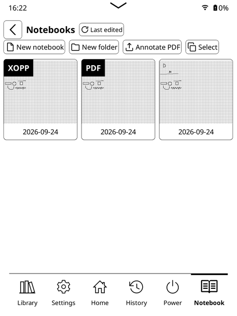
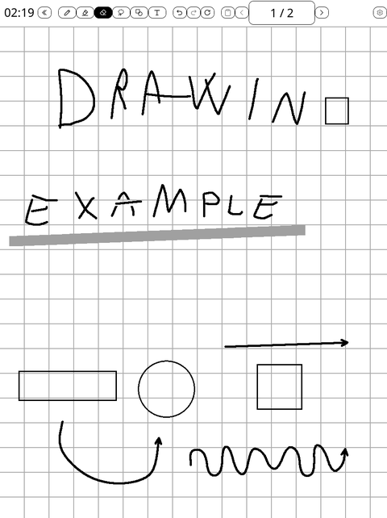
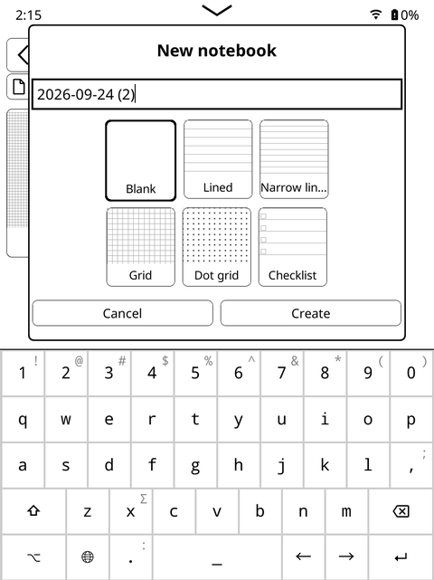
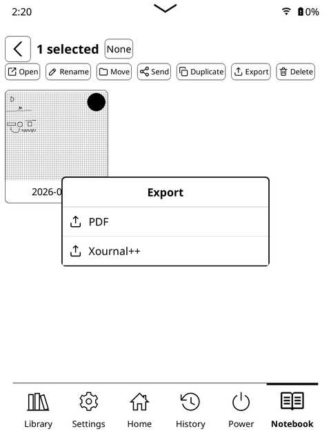

# Notebook for KOReader

[](https://github.com/pierspad/notebook.koplugin/releases/latest) [](https://github.com/pierspad/notebook.koplugin/actions/workflows/ci.yaml) [](https://github.com/koreader/koreader)

[](https://github.com/sponsors/pierspad) [](https://buymeacoffee.com/pierspad) [](https://ko-fi.com/pierspad)

A handwriting notebook plugin for KOReader, designed for the Kindle Scribe and
other stylus-capable e-ink devices. It does not patch KOReader.

| Gallery & Organization | Drawing & Tools |
| :---: | :---: |
|  |  |
| **Paper Templates** | **PDF & XOPP Export** |
|  |  |

## Install

1. Download the latest `notebook.koplugin-<version>.zip` from
   [Releases](https://github.com/pierspad/notebook.koplugin/releases/latest).
2. Extract `notebook.koplugin` into KOReader's plugin directory:
   - Kindle: `/mnt/us/koreader/plugins/`
   - Kobo: `/.adds/koreader/plugins/`
3. Restart KOReader, then open **Tools → More tools → Notebook**.

Notebooks are stored in `koreader/notebook/`.

### Input debug log

To capture a device-specific pen problem, create an empty file named `_debug_`
inside `koreader/notebook/`, then close and reopen Notebook. Reproduce the
problem and send `koreader/notebook/notebook-debug.log` with the device model,
firmware version, KOReader version, and a short description of where you touched
the display. The log records raw and screen coordinates, selected tools, touch
events, and rotation; it does not contain notebook pages or handwriting content.
The log rotates at about 1 MB: if `notebook-debug.log.1` exists, send that too.
Together the two files use at most about 2 MB. Delete `_debug_` and reopen
Notebook to stop logging. You can then delete both log files.

## Dispositivi

### Testati

- Amazon Kindle Scribe (1ª generazione)

### Da verificare

- Altri modelli Kindle Scribe
- Dispositivi KOReader con penna/stilo

Notebook è un plugin di KOReader; la compatibilità non dipende dal launcher
(per esempio ZenUI o Simple UI). Le voci “da verificare” non sono ancora state
provate e non implicano supporto confermato.

> [!TIP]
> You can also place Notebook directly on KOReader's bottom navigation bar using [SimpleUI](https://github.com/doctorhetfield-cmd/simpleui.koplugin) (Custom quick actions → Plugin → Notebook, icon `F405`).

## Features

- Fineliner, pressure-sensitive fountain pen and pencil, with a color palette.
- Highlighter; whole-stroke and partial-stroke erasers.
- Palm rejection and direct stylus input.
- Explicit triangles, rectangles, squares and circles; freehand ink stays freehand.
- Lasso selection with move, cut, copy, paste and delete.
- Editable text, multiple pages and per-page paper templates.
- PDF and Xournal++ export; optional LocalSend integration.

Hold or double-tap a tool button to open its options. After cutting or copying,
use the Paste button in the top bar.

### Custom pen icons

KOReader looks in its user `icons` directory before bundled icons. On Kindle,
place your SVGs in `/mnt/us/koreader/icons/` with these exact names:
`notebook.pen.svg` (toolbar), `notebook.fineliner.svg` (Fineliner option), and
`notebook.pencil.svg` (Pencil option). The current fountain pen icon is
`notebook.fountain.svg` if you ever want to replace it too. Use a square
`viewBox="0 0 24 24"`, then restart KOReader so its icon cache sees the files.
These files stay outside the plugin directory when the plugin is updated.

The KOReader desktop emulator can check the color palette and grayscale
fallback, but its display is monochrome. To confirm actual color rendering,
test on a color e-ink device.

## Development

Requires LuaJIT and `luacheck`.

```bash
make verify       # lint and tests
make ci           # verification plus package checks
make package      # build the installable zip in build/
```

For device deployment, copy `kindle.env.example` to `kindle.env`, configure the
device, then run `make deploy`. See `tools/deploy.sh --help` for options.

## Contributing

Pull requests are welcome! For major changes, please open an issue first to discuss your ideas.

If Notebook is useful to you and you want to support its maintenance, you can support via:
- [GitHub Sponsors](https://github.com/sponsors/pierspad)
- [Buy Me a Coffee](https://buymeacoffee.com/pierspad)
- [Ko-fi](https://ko-fi.com/pierspad)

Sponsorship is optional and does not unlock features.

---

## LLM Disclosure

This project was developed with the assistance of Large Language Models, used to support code writing and documentation.

---

## License

This project is licensed under the MIT License — see the [LICENSE](LICENSE) file for details.
