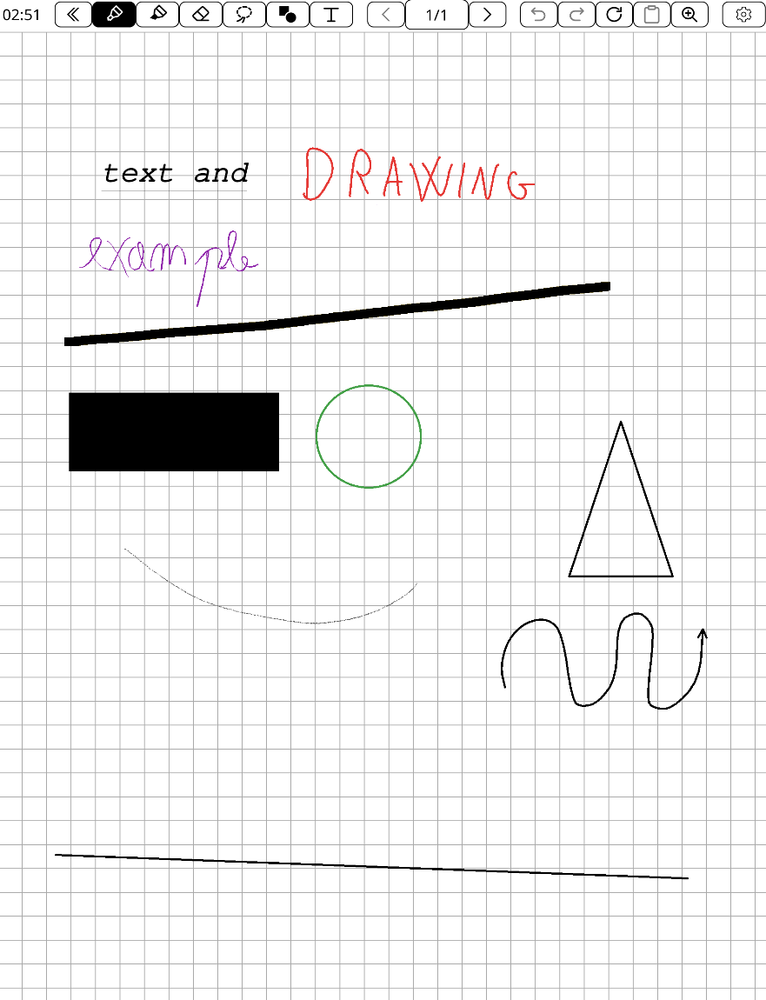
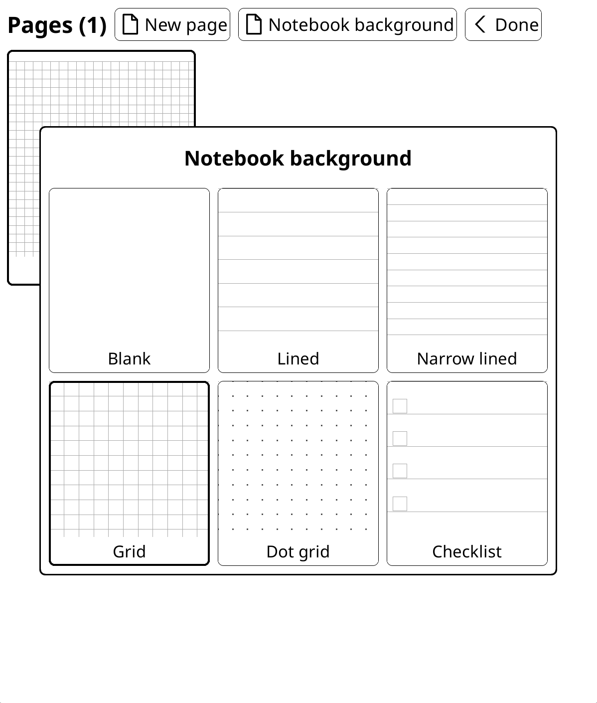
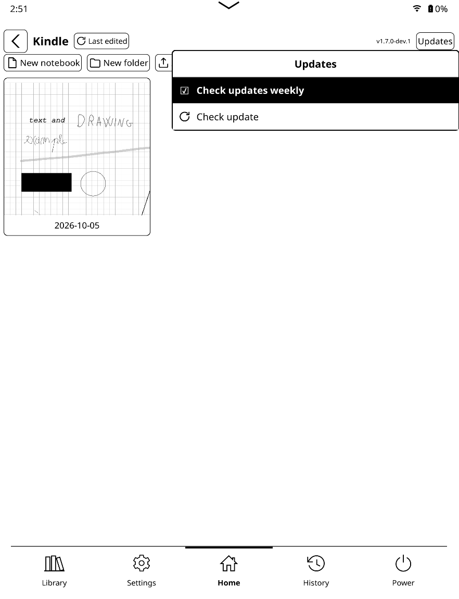

# Notebook per KOReader

[](https://github.com/pierspad/notebook.koplugin/releases/latest) [](https://github.com/pierspad/notebook.koplugin/actions/workflows/ci.yaml) [](https://github.com/koreader/koreader)

[](https://github.com/sponsors/pierspad) [](https://buymeacoffee.com/pierspad) [](https://ko-fi.com/pierspad)

Un plugin open source per scrivere e disegnare in KOReader, sviluppato sul
Kindle Scribe e utilizzabile senza applicare patch a KOReader.

Documentazione aggiornata il **5 ottobre 2026**. Questa revisione italiana è
pronta per la verifica dei contenuti prima della traduzione finale in inglese.

| Galleria | Scrittura, testo e forme |
| :---: | :---: |
|  |  |

| Penna e colori | Evidenziatore |
| :---: | :---: |
|  |  |
| **Gomma** | **Forme** |
|  |  |
| **Testo** | **Modelli di carta** |
|  |  |

Schermate acquisite nell’emulatore il 5 ottobre 2026. La reattività della penna
e il refresh e-ink si verificano sul dispositivo reale.

## Installazione

### Dallo ZIP della release

1. Scarica `notebook.koplugin-<versione>.zip` da
   [Releases](https://github.com/pierspad/notebook.koplugin/releases/latest).
   Usa lo ZIP allegato alla release, non **Source code (zip)**.
2. Chiudi KOReader. Estrai la cartella `notebook.koplugin` in `koreader/plugins/`.
   Su Kobo il percorso è generalmente `.adds/koreader/plugins/`; su Kindle,
   `koreader/plugins/` nella memoria esposta via USB.
3. Verifica che `plugins/notebook.koplugin/main.lua` e `_meta.lua` siano
   direttamente nella cartella del plugin, senza livelli aggiuntivi.
4. Riavvia KOReader e apri **Strumenti → Altri strumenti → Notebook**.

### Dal sorgente

Non serve compilare il plugin Lua.

```bash
git clone --branch main --depth 1 https://github.com/pierspad/notebook.koplugin.git
cd notebook.koplugin
```

Chiudi KOReader e copia **il contenuto di `lua/`**, inclusi `icons/` e `locale/`,
in `koreader/plugins/notebook.koplugin/`. La cartella `spec/` dei test può essere
omessa. Non copiare il repository intero e non aggiungere un livello `lua/`.
Per un checkout da contrib, usa il contenuto di `notebook.koplugin/lua/`.

Per aggiornare, sposta prima la vecchia cartella del plugin fuori da `plugins/`
come backup e copia la nuova cartella completa. I quaderni sono separati, in
`koreader/notebook/`: conserva quella directory.

Il menu **Aggiornamenti → Controlla aggiornamenti** cerca nuove release stabili.
Dopo aver installato un aggiornamento, riavvia KOReader.



## Funzioni

- **Penna**: fineliner a spessore uniforme, stilografica sensibile alla pressione
  e matita; cinque spessori e otto colori. Sono disponibili gli stili linea e
  freccia e il raddrizzamento tenendo ferma la penna al termine del tratto.
- **Evidenziatore**: colori e spessori selezionabili, con anteprima leggera che
  mantiene leggibile il contenuto sottostante.
- **Gomma**: cancella tratti interi oppure soltanto la parte toccata, con cinque
  dimensioni disponibili.
- **Forme**: quadrati, rettangoli, cerchi e triangoli, con contorno o riempimento.
- **Testo**: blocchi modificabili, caratteri sans-serif, serif e monospaziati,
  dimensioni da 10 a 96 pt, grassetto, corsivo, sottolineato e sfondo bianco o
  trasparente. Il selettore mostra un’anteprima.
- **Lazo e appunti**: seleziona tratti, testo e immagini per spostarli, copiarli,
  tagliarli, duplicarli o eliminarli. Il pulsante Incolla si attiva quando sono
  presenti elementi negli appunti.
- **Zoom 2×**: scrittura ingrandita anche sui PDF importati; trascina con un dito
  per spostarti e usa di nuovo il pulsante zoom per tornare alla pagina intera.
- **Quaderni multipagina**: galleria, cartelle, miniature delle pagine e riordino.
  Carta bianca, a righe, a righe strette, quadrettata, puntinata e checklist.
- **Stilo**: gestione degli eventi del digitalizzatore, esclusione dei tocchi
  del palmo e pulsante laterale configurabile per evidenziatore, gomma o lazo.

Una pressione prolungata o un doppio tocco su uno strumento apre le sue opzioni.
I menu degli strumenti restano aperti per modificare più proprietà.
Per annullare con il gesto, esegui due tocchi consecutivi **con due dita per
ciascun tocco**, nella stessa zona entro mezzo secondo. Il gesto è disattivato
durante il disegno con le dita, una selezione, l’uso dello stilo o la sospensione.
Annulla e Ripeti sono disponibili anche nella barra.

## Menu del quaderno


L’ingranaggio apre le sezioni **Quaderni**, **Pagina** e **Impostazioni**.
Le voci si affiancano quando le etichette entrano per intero. L’ingranaggio
si evidenzia mentre il menu è aperto; alla chiusura torna selezionato lo
strumento in uso, senza cambiare lo strumento di disegno.

Dal menu puoi creare un quaderno, aprire un PDF, tornare alla libreria oppure
scegliere uno degli ultimi otto quaderni, con miniature caricate progressivamente. Il documento corrente viene salvato
prima del cambio; se il salvataggio fallisce, resta aperto.
Puoi anche regolare distanza e tonalità delle righe o della griglia, inserire
immagini e aprire le preferenze degli strumenti.

### Immagini incorporate

**Inserisci immagine** importa PNG/JPEG, fino a 4 MiB e 8 megapixel per immagine.
I dati vengono incorporati nel quaderno: il file originale non serve più.
Il lazo permette di spostare, ridimensionare, duplicare ed eliminare le immagini;
la gomma agisce sull’inchiostro. Le immagini sono incluse in PDF, SVG e XOPP.

## PDF, esportazione e condivisione

Importa un PDF dalla galleria o dal menu del quaderno per usarne le pagine come
sfondo. Le annotazioni sono conservate in un documento Notebook separato e il
PDF originale resta intatto.

- **PDF**: sfondo e annotazioni composti in un unico documento.
- **SVG**: tratti e testo vettoriali, con immagini incorporate; esclude la carta
  e lo sfondo PDF.
- **Xournal++ (`.xopp`)**: annotazioni modificabili. Per quaderni basati su PDF,
  conserva `.xopp` e il relativo `.xopp.bg.pdf` nella stessa cartella.

[LocalSend](https://github.com/kaikozlov/localsend.koplugin) è opzionale e permette
l’invio via rete locale. Installa anche l’app LocalSend sul destinatario.
[SimpleUI](https://github.com/doctorhetfield-cmd/simpleui.koplugin) è opzionale:
puoi aggiungere Notebook alla barra inferiore con **Azioni rapide personalizzate
→ Plugin → Notebook**, usando il simbolo Nerd Font `F405`.

## Compatibilità

Il Kindle Scribe è il dispositivo principale di sviluppo e verifica. Pressione,
pulsanti e input della penna dipendono dal driver KOReader e dal firmware.
L’emulatore Linux viene usato per test automatici e controlli di layout con
widget reali. Altri dispositivi non sono confermati da questi controlli:
uno schermo con stilo, da solo, non garantisce la compatibilità.
Per segnalare problemi includi modello, firmware e versione di KOReader.

## Icone personalizzate

Le icone SVG sono in `lua/icons/` nel sorgente e in
`koreader/plugins/notebook.koplugin/icons/` nell’installazione. All’avvio vengono
sincronizzate nella cartella utente `icons/` di KOReader: personalizza i file
nella cartella del plugin, perché le copie utente possono essere sovrascritte.

Usa elementi SVG standard compatibili con NanoSVG (`path`, `rect`, `circle`,
`polygon`), un viewBox quadrato e nero su sfondo trasparente. Evita CSS, maschere
e clipPath. Riavvia KOReader dopo le modifiche per ricaricare la cache.

## Diagnostica e segnalazioni

Apri il menu dell’ingranaggio e scegli **Avvia log di input**. Riproduci il
problema sul quaderno già aperto (preferibilmente su una pagina di prova), poi scegli **Ferma log di input** e allega
`koreader/notebook/notebook-debug.log`. Se esiste anche `.log.1`, allega entrambi.
Fermare la registrazione conserva i file prodotti.

In alternativa, crea un quaderno `_debug_` oppure un file vuoto `_debug_` in
`koreader/notebook/` e riapri Notebook. Per fermare questo metodo, elimina il
quaderno o il marcatore e riapri Notebook. Il marcatore viene controllato
all’apertura; il comando dal menu agisce immediatamente sul quaderno aperto e
vale anche passando ad altri quaderni nella stessa sessione. **Ferma log di input**
ha priorità sul marcatore fino al riavvio di KOReader. I due metodi scrivono lo
stesso file e non recuperano eventi avvenuti prima dell’attivazione.

Il log registra coordinate, tocchi, rotazione e stato dello stilo. Non incorpora
pagine o immagini, ma le coordinate possono descrivere i movimenti della penna:
usa una pagina senza contenuti sensibili. La rotazione limita i due file a circa
2 MB complessivi. Per un errore del plugin allega anche
`koreader/notebook/.logs/notebook-error.log`, se presente; per un crash di KOReader,
`koreader/crash.log`.

Usa il modulo **Bug report** nelle issue. Indica dispositivo, firmware/OS,
versioni KOReader e Notebook, sorgente dell’installazione, modello di stilo e
altri plugin attivi. Descrivi passaggi, risultato atteso ed effettivo e frequenza.
Per problemi di disegno aggiungi orientamento, zoom e strumento; per sospensione
indica durata e modalità di blocco/sblocco. I log aiutano ma non sono obbligatori.

## Sviluppo

Servono LuaJIT, luacheck e gettext (`msgfmt`) per i controlli, non per installare
il sorgente sul dispositivo. Architettura e test sono nel
[manuale tecnico](docs/README.md); i cataloghi in
[Tradurre Notebook](lua/locale/README.md).

```bash
make verify                # lint, test, traduzioni e controlli benchmark
make test-native-features  # widget ed esportazioni con un runtime KOReader compilato
make package               # ZIP installabile in build/
make ci                    # verifica e controllo del pacchetto
```

Per il deploy sul dispositivo, configura `kindle.env` a partire da
`kindle.env.example` e usa `make deploy`; consulta `tools/deploy.sh --help`.
Le annotazioni sovrapposte al lettore sono un progetto futuro descritto in
[Reader Annotations Plan](docs/READER_ANNOTATIONS.md).

## Contributi e sostegno

Pull request e segnalazioni sono benvenute. Per cambiamenti importanti, apri
prima una issue per discuterne. Puoi sostenere la manutenzione tramite
[GitHub Sponsors](https://github.com/sponsors/pierspad),
[Buy Me a Coffee](https://buymeacoffee.com/pierspad) o
[Ko-fi](https://ko-fi.com/pierspad). Il sostegno è facoltativo e non sblocca funzioni.

Il progetto è stato sviluppato con l’assistenza di modelli linguistici per
codice e documentazione. Si ispira a
[localsend.koplugin](https://github.com/kaikozlov/localsend.koplugin),
[pencil.koplugin](https://github.com/mysticknits/pencil.koplugin) e
[ink-away.koplugin](https://github.com/EmirErtorer/ink-away.koplugin).

Licenza [MIT](LICENSE).
