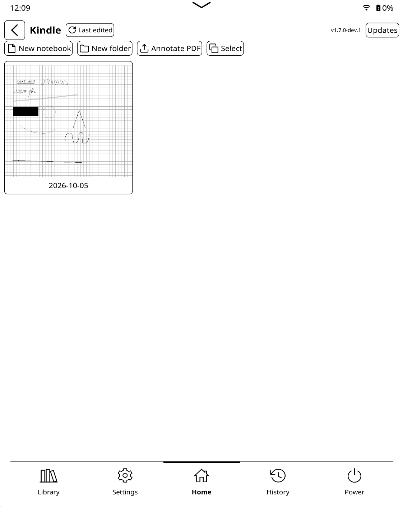
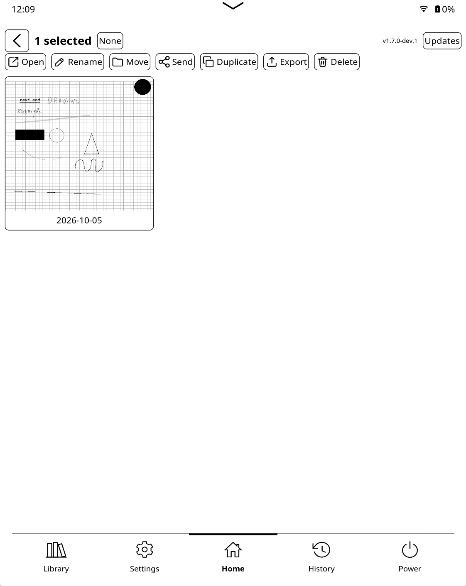
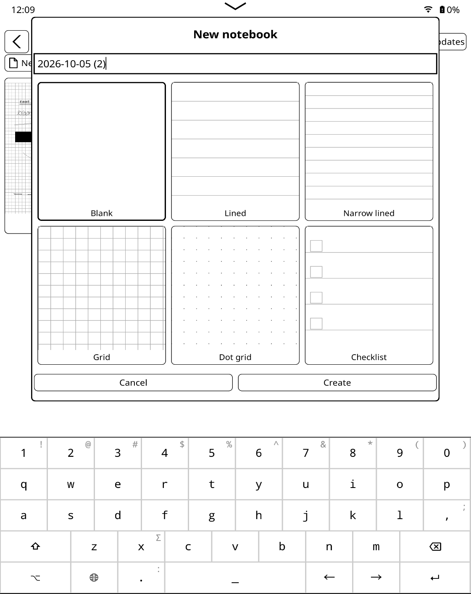
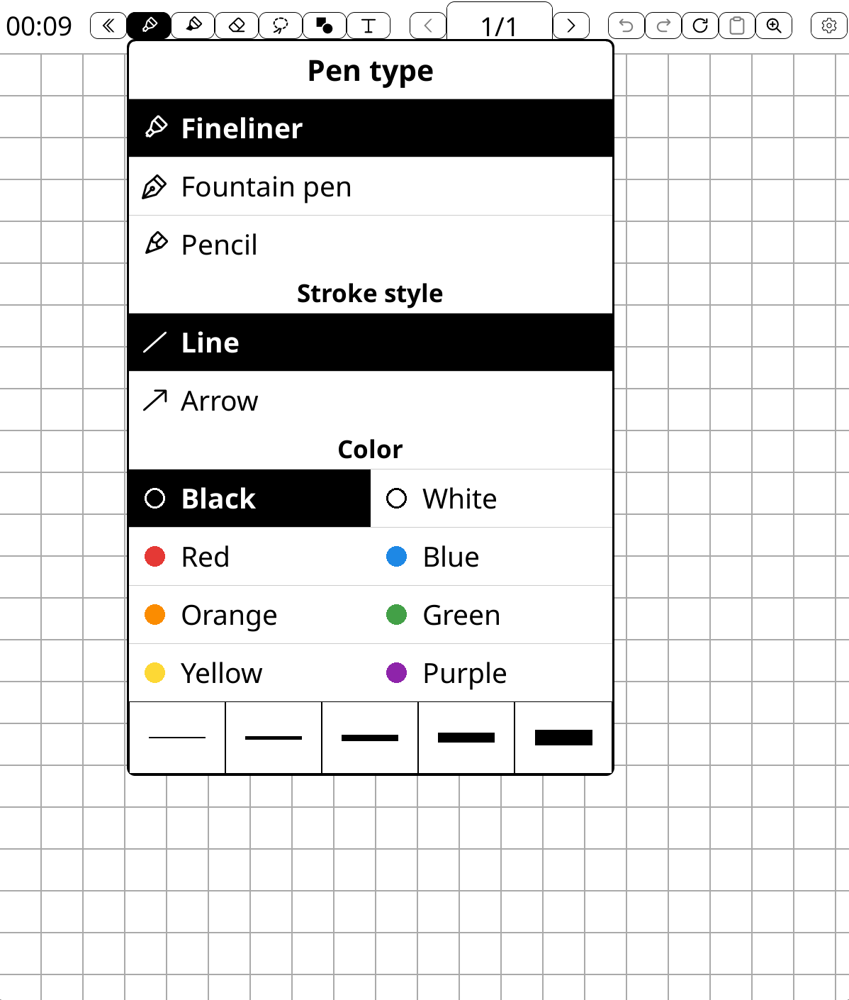
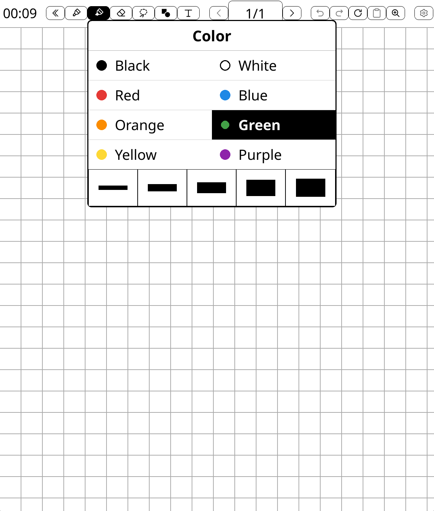
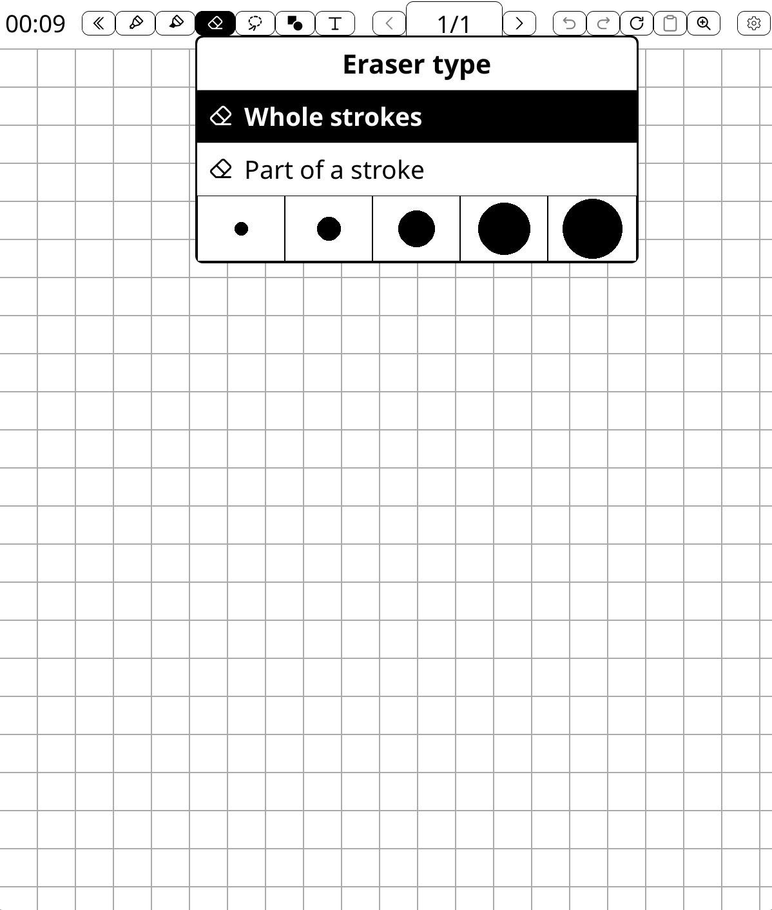
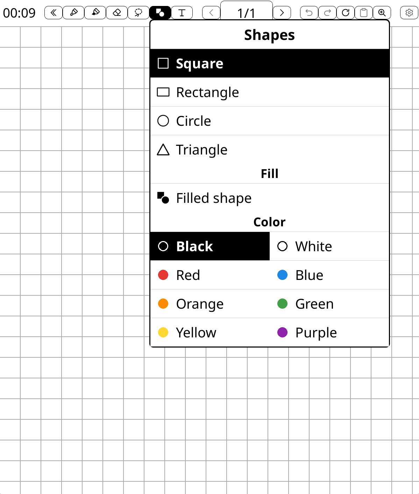
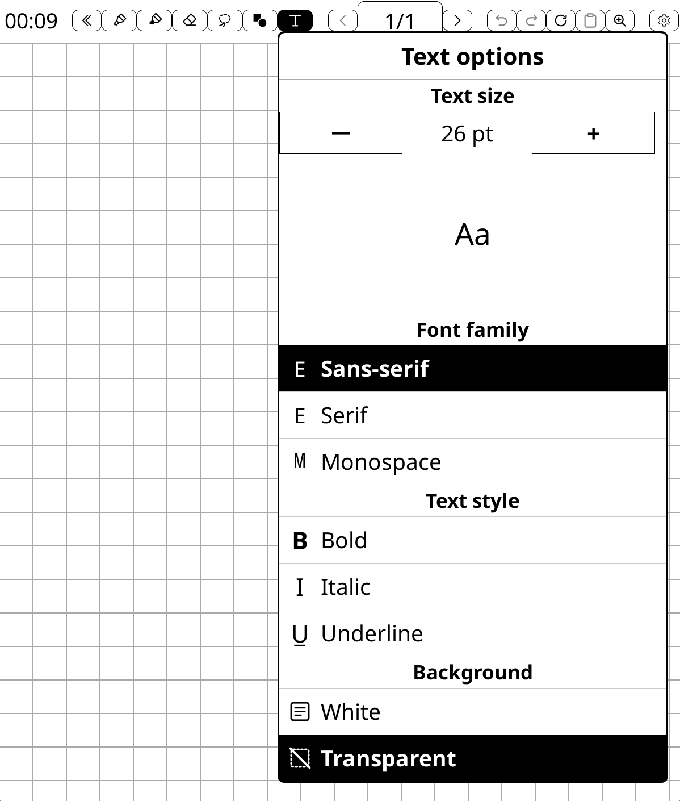
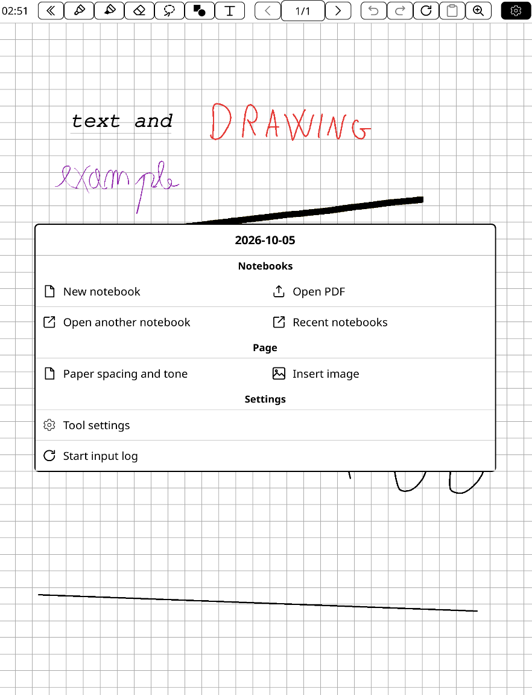
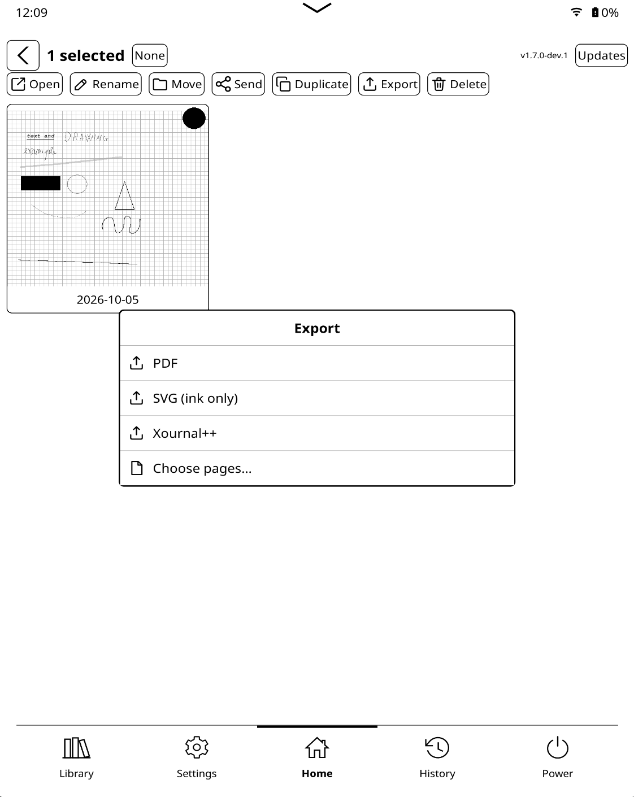

# Notebook user guide

See the [README](../README.md) for installation and compatibility, and the
[technical reference](README.md) for architecture and development.

## Gallery and pages

Create notebooks and folders, or import a PDF from the gallery. Select items to
open, rename, move, duplicate, share, export or delete them. Page thumbnails
provide navigation and reordering. Changes are saved automatically; closing a
notebook or switching documents completes the current interaction and saves it.
If saving fails during a document switch, the current document remains open.

Choose blank, lined, narrow lined, grid, dot grid or checklist paper when creating
a notebook. This sets the default; individual pages can use different templates.
Adjust line spacing and shade from the notebook menu.

## Drawing tools

Long-press or double-tap a tool to open its options. Menus stay open while you
change multiple properties.

- Pen: fineliner, pressure-sensitive fountain pen and pencil, five widths and
  eight colors. Line and arrow styles are available; holding still at the end
  of a stroke can straighten it.
- Highlighter: selectable colors and widths, with a light preview that keeps
  underlying content readable.
- Eraser: erase whole strokes or only the touched segment, with five sizes.
  Recognized lines and arrows erase as ink; partial erasing leaves ordinary
  stroke fragments. Closed shapes are selected for editing or deletion.
- Shapes: squares, rectangles, circles and triangles, outlined or filled.
- Text: editable blocks, sans-serif, serif and monospace fonts, 10–96 pt,
  bold, italic, underline, and white or transparent backgrounds.

Undo and redo are available on the toolbar. To undo with a gesture, tap twice
with two fingers on each tap, in the same area within half a second. This gesture
is disabled during finger drawing, selection, stylus use and suspension.

## Selection, images and zoom

Use the lasso to select strokes, text and images, then move, copy, cut, duplicate
or delete them. Paste becomes available when the clipboard contains elements.
For a single closed shape, **Above text** and **Below text** change its drawing
order, useful for placing a filled shape behind writing. Lines and arrows omit
these controls.

**Insert image** embeds PNG/JPEG files up to 4 MiB and 8 megapixels each. The
original file is no longer required. Use the lasso to move, resize, duplicate or
delete images; the eraser affects ink. Images are included in PDF, SVG and XOPP.

The zoom button switches between full-page and 2× views, including imported PDF
pages. Drag with a finger to pan while zoomed in.

The gear menu contains notebook navigation, page actions and settings, including
recent notebooks and stylus button preferences.

## Export and sharing

PDF import uses document pages as backgrounds and stores annotations separately.
The original PDF is preserved.

- PDF includes backgrounds and annotations.
- SVG includes vector strokes, text and embedded images, excluding paper and PDF backgrounds.
- Xournal++ keeps annotations editable but approximates some brush styles.
  Keep `.xopp` and `.xopp.bg.pdf` together for PDF-based notebooks.

Use **Choose pages…** to export a page range.

With a compatible LocalSend plugin installed, share as PDF or Xournal++ over the
local network. Install LocalSend on the receiving device too. For SVG, export
first and send the file from the gallery.

SimpleUI can add Notebook to its bottom navigation bar through
**Custom Quick Actions → Plugin → Notebook**. Use Nerd Font symbol `F405` for
its icon. Neither integration is required to use Notebook.

## Custom icons

Edit SVG files in `koreader/plugins/notebook.koplugin/icons/` (`lua/icons/` in
source). Notebook synchronizes them to KOReader's user `icons/` directory on
startup, so changes to those copies may be overwritten. Restart KOReader after
editing. Use NanoSVG-compatible elements such as `path`, `rect`, `circle` and
`polygon`, a square viewBox and black artwork on a transparent background;
avoid CSS, masks and clipPath.

## Diagnostics

In the gear menu, choose **Start input log**, reproduce the issue on a test page,
and choose **Stop input log**. Attach `koreader/notebook/notebook-debug.log` and
`notebook-debug.log.1` if present. Stopping preserves existing logs.

Alternatively, create a notebook named `_debug_` or an empty `_debug_` file in
`koreader/notebook/`, then reopen Notebook. Remove the notebook or marker and
reopen Notebook to disable this method. The marker is checked when Notebook
opens; the menu command acts immediately and follows document switches in the
current session. **Stop input log** overrides the marker until KOReader restarts.
Neither method recovers earlier events.

The log records coordinates, touch, rotation and stylus state. It does not embed
pages or images, but coordinates may reveal pen movements: use a page without
sensitive content. Rotation bounds the two files to approximately 2 MB total.
For plugin errors, also attach `koreader/notebook/.logs/notebook-error.log` if
present; for KOReader crashes, attach `koreader/crash.log`.

Include device, firmware/OS, KOReader and Notebook versions, installation source,
stylus model, other active plugins, reproduction steps, expected and actual
results, and frequency. For drawing issues, include orientation, zoom and tool;
for suspension, include duration and lock/unlock behavior.

## Testing with a mouse in the emulator

Enable **Finger → Draws** in Notebook settings and use the full-page (1×) view
for mouse drawing. In 2× view, finger/mouse drags pan the page; writing at zoom
uses stylus events. The moving highlighter uses a black hatched preview; releasing
the mouse commits the stroke and restores its selected color. Taps, quick swipes,
long-press drags and releases outside the page all finish the owned drawing.

For native regression checks, run `make test-native-features` with a compiled
KOReader runtime. These include real gesture dispatch and check that colored
mouse strokes survive a page repaint.
